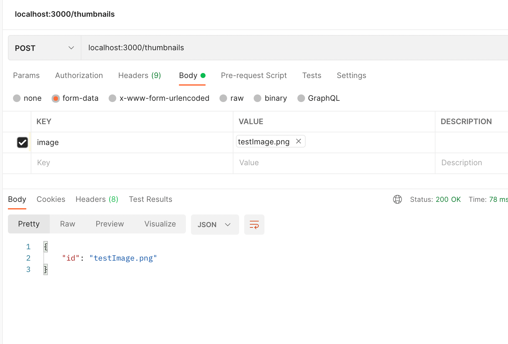
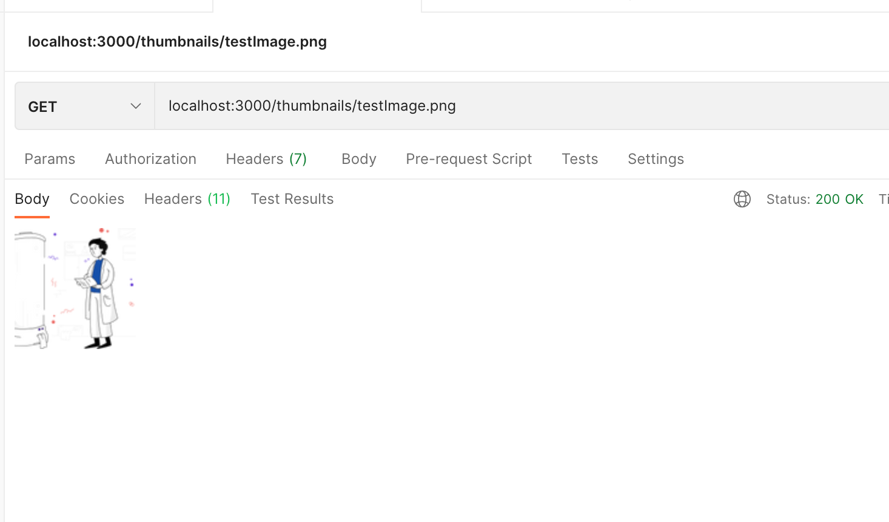

# Thumbnail Generator API

## Running the Service

Simply run `docker-compose up` to run the service. This will run the following containers

-   thumbnail-generator-api
-   redis-queue

### Running in developer mode

We can run the service in developer mode using this command:

```
docker-compose -f docker-compose.yml -f docker-compose.dev.yml up -d --build
```

## Accessing the Endpoints

-   recommend interact using Postman

### POST /thumbnail

-   POST endpoint where image can be uploaded for thumbnail generation
-   returns id of the generated thumbnail
    -   currently returns the file name of the image
-   request is in `form-data` type

```
# request
curl --X POST 'localhost:3000/thumbnails' --form "image=@assets/testImage.png;type=multipart/form-data

# returns
{"id":"testImage.png"}
```



### GET /thumbnail/:id

-   GET endpoint to see generated thumbnail given id

```
# request
curl --X GET 'localhost:3000/thumbnails/testImage.png' -o test.png

# return
<image>
```



## Running the Tests

Run `npm run test` on the root of the project.

## Architecture

### REST API

The REST API is built using `express`. It has 1 endpoint with two possible methods (POST and GET). It has a dependency on the Thumbnail Generation job to be able to return a generated thumbnail to the user

### Thumbnail Generation

The Thumbnail Generation is built using `sharp`, a Node.js image processing library.

### Job Queue

This is a long-running application, meaning requests should be catered and processed with no downtime. This is possible using a job-queue manager `bull` and is connected with `redis`.

## Improvements

-   Uploaded photos and generated thumbnails do not persist in the Docker container when it is removed. It would be recommended to have them to be saved in a separate persistent storage.
-   Images (both in storage and thumbnail directories) can be overriden if an image of the same file name and type is uploaded. I would generate unique IDs per image and have a small database list down image sources and ther unique ID.
-   Improve on writing unit test as I have not mocked properly the redis queue and also increase code coverage.
-   Thumbnail generation can still be improved in quality and the area chosed to be resized/cropped into a 100x100 px image.
